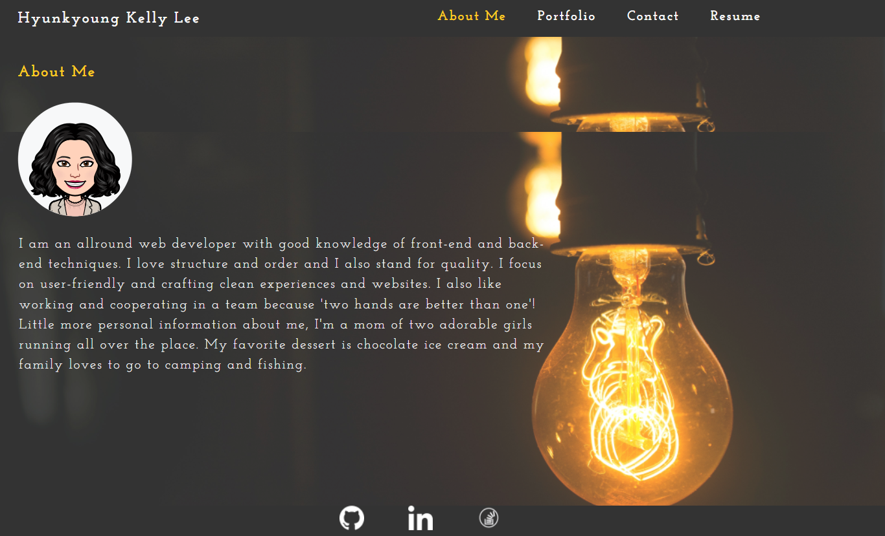
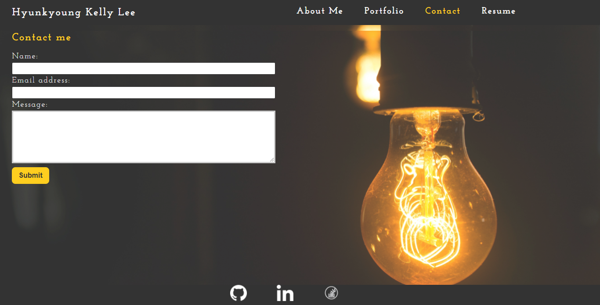
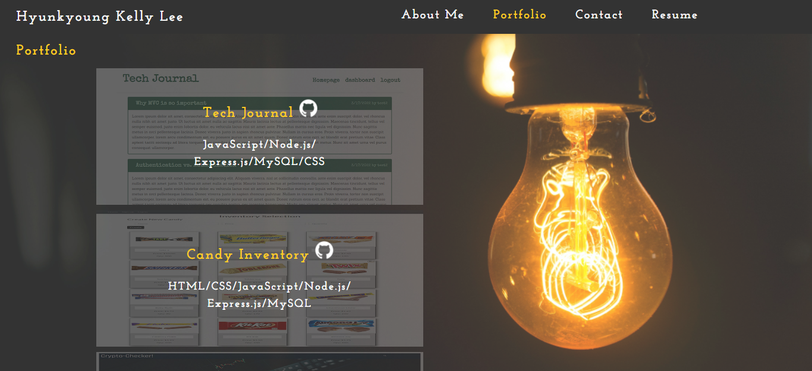
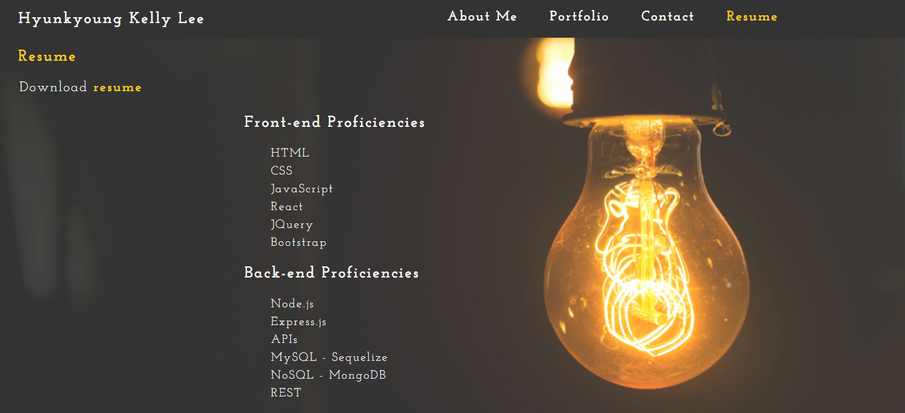

    
    
<h1># Portfolio</h1> 
<h2>## Description</h2>
    
Portfolio website showcases a webpage for my deployed web applications. It contains introduction about myself, my applications, contacts, and my web developing techniques.

<h2>## Table of Contents</h2>
    <ul>
        <li><a href="#usage">Usage</a></li>
        <li><a href="#screenshot">Screenshot</a></li>
        <li><a href="#license">License</a></li>
        <li><a href="#questions">Questions</a></li>
    </ul>
<h2 id="usage">## Usage</h2>
    
Please visit at https://khklee.github.io/HK-portfolio/.

<h2 id="screenshot">## Screenshot</h2>
    
    
    
    
<h2 id="license">## License</h2>
    

      This application is covered under MIT and please <a href="https://choosealicense.com/licenses/">click here</a> to find out more details.
    

<h2 id="questions">## Questions</h2>
    
<a href="https://github.com/khklee">Github</a>

    
If you have additional questions, please <a href="mailto: amorfati38@gmail.com">"Reach Me".</a>
            
  